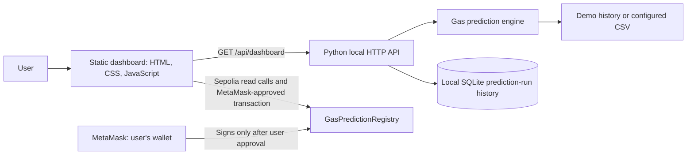

# GasGuard AI

GasGuard AI is a gas-fee forecasting dashboard that recommends a lower-fee
transaction window and anchors a compact prediction fingerprint to Ethereum
Sepolia. Its registry makes it possible to retrieve the committed prediction
and independently check its hash against the on-chain record.

> **Demo data:** The default gas history is synthetic sample data, not live
> Sepolia gas observations. The dashboard labels it as demo data.

## 1. Problem

Gas fees vary over time. Users need a useful forecast of near-term fees and a
way to decide whether waiting for a lower-fee window may be worthwhile.

## 2. Solution

GasGuard loads and validates hourly gas-fee history, evaluates a lightweight
forecast model on a chronological holdout, forecasts upcoming hours, and
selects the cheapest predicted contiguous window. The browser can anchor a
fingerprint of that prediction to the deployed Sepolia registry using
MetaMask. Later, it reads the record and calls the contract's verification
function to check that the supplied hash matches the committed hash.

## 3. Why Blockchain?

The registry emits a `PredictionStored` event and preserves the prediction
fingerprint in Ethereum Sepolia's replicated, append-only history. This creates
a public commitment that can be checked independently of GasGuard's local
database or dashboard. If the prediction contents associated with a fingerprint
are changed, their recomputed hash will no longer match the committed value.

The contract stores prediction metadata and a hash, not the full gas dataset.
The chain does not establish that a forecast is accurate or that input data is
true; it provides a tamper-evident commitment and an independently callable
verification result.

## 4. How It Works

```text
Prediction
→ Prediction Hash
→ Anchor on Sepolia
→ PredictionStored event
→ Read from contract
→ Verify hash
→ VERIFIED ON-CHAIN
```

Anchoring is a state-changing transaction and requires explicit MetaMask
approval. Verification uses read-only calls (`getPrediction` and
`verifyPrediction`) and does not submit a transaction.

## 5. Architecture



- **Frontend:** `web/index.html`, `web/styles.css`, and `web/app.js`. The
  browser fetches prediction data from the local API and uses the injected
  MetaMask provider for wallet access and Sepolia contract calls. Contract ABI
  definitions are in `web/registry-abi.json`; the frontend contains matching
  calldata encoding/decoding helpers.
- **Backend:** `backend/api.py` serves both the static dashboard and JSON API.
  `backend/gas_prediction.py` loads observations and performs model evaluation
  and forecasting.
- **Local persistence:** SQLite records model runs in
  `backend/gasguard_history.sqlite3`. This is dashboard history, not the
  blockchain registry.
- **Smart contract:** `contracts/GasPredictionRegistry.sol` stores prediction
  metadata and a `bytes32` hash on Sepolia.

## 6. AI / Prediction Model

The dependency-free Python engine (`backend/gas_prediction.py`) fits a
lightweight regularized least-squares linear model. Its features include an
intercept, a linear time trend, daily sine/cosine terms, and weekly sine/cosine
terms.

Model evaluation uses the first 80% of observations for training and the final
20% as a chronological validation holdout. The engine reports measured MAE and
WMAPE. Its confidence score is a documented heuristic derived from holdout
WMAPE and validation sample coverage; it is not a probability.

Without a CSV configuration, the model generates 720 synthetic hourly
observations (30 days) and labels the source `demo`. CSV observations must
include a `source` of `demo` or `live`; use `live` only for observations
actually collected from a real source. The application does not fetch a live
gas feed by default.

The model forecasts the requested horizon, finds the lowest-average
consecutive window, and calculates non-negative estimated savings relative to
the latest observation.

## 7. Smart Contract

| Property | Value |
|---|---|
| Contract | `GasPredictionRegistry` |
| Network | Ethereum Sepolia testnet |
| Chain ID | `11155111` (`0xaa36a7`) |
| Deployed address | `0xf6e536d1e3ed14ca5793aa1db6021cd77a661787` |
| Solidity pragma | `^0.8.24` |

The contract constructor rejects deployment unless the current chain ID is
Sepolia. The deployed contract is already in use; this project does not need
to redeploy it.

### Registry functions

- `storePrediction(...)` stores a unique prediction ID, predicted gas fee in
  wei, prediction timestamp, recommended window start and end, prediction
  hash, and model version. It emits `PredictionStored`.
- `getPrediction(predictionId)` reads the stored record.
- `verifyPrediction(predictionId, predictionHash)` returns whether that ID
  exists and its stored hash equals the supplied hash.

`web/registry-abi.json` contains the ABI for these functions and the
`PredictionStored` event. The frontend uses its corresponding function
signatures and encoders for the browser-provider calls.

## 8. Blockchain Proof

The following successful Sepolia anchor transaction was tested:

- Transaction:
  [`0x884fb1987c0ffd4504acca365e0406fdd3794f6a0ee3a2b8aa183753c9e98890`](https://sepolia.etherscan.io/tx/0x884fb1987c0ffd4504acca365e0406fdd3794f6a0ee3a2b8aa183753c9e98890)
- The receipt emitted `PredictionStored` from the configured
  `GasPredictionRegistry`.
- The stored prediction was retrieved with `getPrediction` and the original
  hash returned `true` from `verifyPrediction`.

The outer transaction destination may be a wallet/provider execution wrapper;
the registry interaction is evidenced by the registry's `PredictionStored`
event in the receipt.

## 9. Frontend

The dashboard presents current observed gas, hourly forecasts, a predicted
versus actual validation chart, a recommended window, estimated savings,
validation-derived confidence and score, local prediction history, and
blockchain/wallet status. The send-now/wait choices are explicitly simulated:
their 5-, 10-, and 15-minute fees linearly interpolate between the latest
observation and the first hourly forecast. They are not live short-interval
predictions. The risk label uses those simulated estimates.

Performance metrics use the model's chronological holdout. The displayed
accuracy estimate is `100 − WMAPE`, not an independently measured real-world
accuracy claim. Synthetic inputs are labeled **DEMO / SIMULATED**.

Prediction history reuses the backend's local SQLite model-run history and
labels those run IDs as local, not blockchain IDs. A separate browser-local
list records a prediction only after an actual Sepolia transaction receipt is
confirmed. Its status changes to **VERIFIED ON-CHAIN** only after the existing
read-only contract verification succeeds.

The integrity demo computes a local SHA-256 fingerprint and lets the user
change a local gas-value copy. Before anchoring, this is only a local demo. For
an anchored prediction, the dashboard loads the saved prediction with
read-only `getPrediction`, reconstructs a candidate fingerprint from the
on-chain fields and the local gas-value copy, then passes that hash to the
read-only `verifyPrediction` call. A changed value returns **VERIFICATION
FAILED**; resetting to the on-chain value allows the same record to verify
again. The test never writes to the blockchain or submits a transaction.

The blockchain controls:

1. Connect to the public account exposed by MetaMask.
2. Require Ethereum Sepolia before registry actions; account and chain changes
   update the interface.
3. Load the deployed address configured in `web/app.js`.
4. Anchor a prediction by asking MetaMask to approve the transaction.
5. Display pending/confirmed/failed state and the provider-returned
   transaction hash with a Sepolia Etherscan link.
6. Verify the saved prediction reference with read-only `getPrediction` and
   `verifyPrediction` calls, then display the on-chain record and verification
   result.

The anchored prediction reference (ID, hash, and transaction hash) is retained
in the browser's local storage so it can be verified later in that browser.
The verification flow requires a connected MetaMask account and Sepolia
registry, but it does not request a transaction signature or spend gas.

The dashboard explicitly labels the network as **Ethereum Sepolia Testnet**
and the demo as **NO REAL MONEY**.

## 10. Demo (60–90 seconds)

1. Open the dashboard at `http://127.0.0.1:8000`.
2. Connect MetaMask and select Ethereum Sepolia.
3. Show the generated forecast, recommended window, and model confidence.
   Point out the demo-data label.
4. Show the simulated send/wait estimates and risk label; explain that these
   are interpolated from an hourly forecast, not a live gas feed.
5. Click **Anchor Prediction**.
6. Review the destination/network and approve the transaction in MetaMask.
7. Show the confirmed transaction hash and Sepolia Etherscan link.
8. Click **Verify On-Chain** and show the retrieved record and
   **VERIFIED ON-CHAIN** result.
9. Change the local anchored gas-fee copy and click **Verify On-Chain** again;
   show **VERIFICATION FAILED**.
10. Click **Reset**, then **Verify On-Chain** again to show
    **VERIFIED ON-CHAIN**.
11. Explain that each verification is read-only and no extra transaction is
    sent for the tamper test.

For a live anchor, the wallet needs Sepolia test ETH to pay Sepolia network
gas. Never use a funded mainnet wallet for this demo.

## 11. Installation

The repository has no `package.json` or npm scripts. The forecasting engine
uses the Python standard library; the HTTP application uses Flask and Flask-CORS,
and Gunicorn is the production WSGI server. Use Python 3.10 or newer. On
Windows, create a project-local virtual environment (if needed) with:

```powershell
py -3 -m venv .venv
.\.venv\Scripts\python.exe -m pip install -r backend\requirements.txt
.\.venv\Scripts\python.exe -m backend.api
```

If setting up a separate environment, create a Python 3.10+ virtual environment
and install the dependencies from `backend/requirements.txt`.

## 12. Environment Variables

The backend reads these optional variables:

| Variable | Purpose |
|---|---|
| `GASGUARD_DATA_CSV` | Path to a gas-history CSV with `timestamp`, `gas_fee_gwei`, and `source` columns. |
| `GASGUARD_DB_PATH` | Optional path overriding the default local SQLite history database. |

There are no `.env.example` files or blockchain secrets required by the
frontend/backend. The registry address is public configuration in
`web/app.js`. Never put wallet secrets in project files.

## 13. Running Locally

From the project root, start the combined Python API and static-file server:

```powershell
.\.venv\Scripts\python.exe -m backend.api
```

Then open:

- Dashboard: `http://127.0.0.1:8000`
- Health check: `http://127.0.0.1:8000/health`
- Health check: `http://127.0.0.1:8000/api/health`
- Dashboard JSON: `http://127.0.0.1:8000/api/dashboard`

To run on port 8765 instead:

```powershell
.\.venv\Scripts\python.exe -m backend.api --port 8765
```

Open `http://127.0.0.1:8765` in the same Chrome profile where MetaMask is
installed.

To run the prediction engine directly:

```powershell
.\.venv\Scripts\python.exe -m backend.gas_prediction --horizon-hours 6 --window-hours 1
```

To use CSV history, set `GASGUARD_DATA_CSV` before starting the server. The CSV
must have timezone-aware ISO 8601 timestamps and these columns:

```csv
timestamp,gas_fee_gwei,source
2026-10-06T10:00:00+00:00,20.5,demo
```

The source must be `demo` or `live`. Only mark rows `live` when they come from
actual observations.

## Render Deployment

Create a Render Web Service with the repository root as its root directory and
use:

- **Build command:** `pip install -r backend/requirements.txt`
- **Start command:** `gunicorn backend.api:app --bind 0.0.0.0:$PORT --timeout 120`

The app serves the existing dashboard assets and JSON endpoints. CORS is
enabled for the public `/api/*` and `/health` endpoints so a separately hosted
Vercel frontend can call this service. These endpoints do not use credentials.
Set `GASGUARD_DATA_CSV` or `GASGUARD_DB_PATH` only when intentionally configuring
those existing data sources; do not put wallet keys or seed phrases in Render
environment variables.

## 14. Testing

Run the existing Python unit tests from the project root:

```powershell
.\.venv\Scripts\python.exe -m unittest discover -v
```

The tests cover CSV loading/validation, demo data identification, prediction
generation and validation metrics, minimum history requirements, cheapest
window selection, savings calculations, API payload generation, and local
history behavior. There is no frontend package build, lint, or typecheck script
configured in this repository.

## 15. Security / Demo Notes

- Ethereum Sepolia testnet only; do not use Ethereum Mainnet.
- No real funds are used by the application. A live Sepolia anchor transaction
  consumes **Sepolia test ETH** for network gas.
- Never use a funded mainnet wallet for testing.
- MetaMask is the user's signer and requires explicit approval for an anchor
  transaction.
- The application does not request or store a private key or seed phrase.
- Prediction data is synthetic/demo data by default, not live Sepolia gas data.
- On-chain verification is read-only and does not submit a transaction.
- Blockchain anchoring proves the committed hash matches the on-chain record;
  it does not prove the source data or model forecast is correct.

## 16. Hackathon Highlights

- Working time-based gas forecast and cheapest-window recommendation.
- Measured chronological holdout metrics rather than invented accuracy
  numbers.
- Real Ethereum Sepolia registry deployment and a tested anchor transaction.
- Prediction metadata and fingerprint stored through the registry contract.
- `PredictionStored` event emitted by the registry.
- MetaMask-approved transaction flow with transaction status and explorer link.
- Read-only on-chain record retrieval and cryptographic hash verification.
- Clear distinction between a confirmed anchor transaction and a verified
  on-chain prediction.
